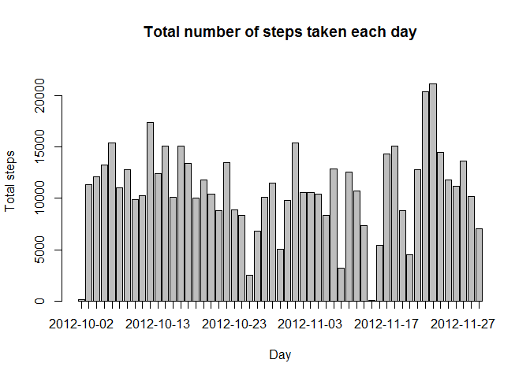
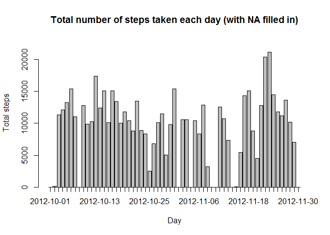
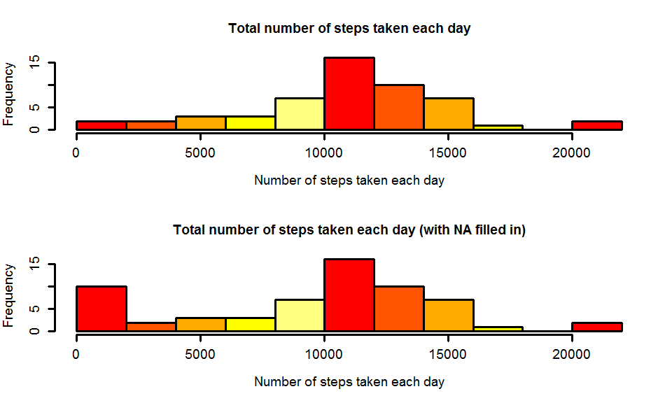
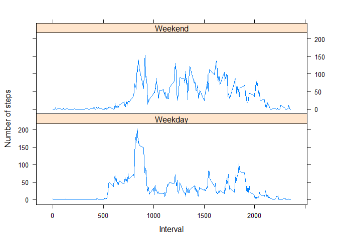

# Reproducible Research: Peer Assessment 1


## Loading and preprocessing the data
Note that the data "activity.zip" can be found in the repository.

Assumption : Unzip activity.zip and we will get activity.csv, which then stored in the 'repdata' directory, one level up from this R markdown file

File tree structure as below:-

*RepData_PeerAssessment1 > repdata > activity.csv

*RepData_PeerAssessment1 > PA1_template.Rmd
        
 


```r
file <- "./repdata/activity.csv"
dat <- read.csv(file, header=TRUE, quote="\"", sep=",")
```

Clean up data by excluding the rows with NA,

```r
clean_dat <- complete.cases(dat)
dat_sum_by_date <- ddply(dat[clean_dat,], c("date"), numcolwise(sum))
```

 
## What is mean total number of steps taken per day?
We can check the total number of steps taken each day with the histogram below,

```r
barplot(dat_sum_by_date$steps, xlab="Day", ylab="Total steps", ylim=c(0,1.1*max(dat_sum_by_date$steps)), 
        main="Total number of steps taken each day",
        axis.lty=1,
        names.arg=as.character(dat_sum_by_date$date))
```

 

Mean total number of steps taken per day,

```r
mean(dat_sum_by_date$steps)
```

```
## [1] 10766.19
```
        


Median total number of steps taken per day,

```r
median(dat_sum_by_date$steps)
```

```
## [1] 10765
```


## What is the average daily activity pattern?


A time series plot (i.e. type = "l") of the 5-minute interval (x-axis) and the average number of steps taken, averaged across all days (y-axis)

```r
dat_avg_by_interval <- ddply(dat[clean_dat,], c("interval"), numcolwise(mean))
plot(dat_avg_by_interval, type="l")
```

 

Which 5-minute interval, on average across all the days in the dataset, contains the maximum number of steps?

```r
dat_avg_by_interval$interval[which.max(dat_avg_by_interval$steps)]  
```

```
## [1] 835
```


## Imputing missing values
Note that there are a number of days/intervals where there are missing values (coded as NA). The presence of missing days may introduce bias into some calculations or summaries of the data.

Calculate and report the total number of missing values in the dataset (i.e. the total number of rows with NAs)

```r
sum(is.na(dat))
```

```
## [1] 2304
```

Devise a strategy for filling in all of the missing values in the dataset. The strategy does not need to be sophisticated. For example, you could use the mean/median for that day, or the mean for that 5-minute interval, etc.

Create a new dataset that is equal to the original dataset but with the missing data filled in. 
Strategy here is to assign NA with the mean for that day, zero otherwise.

```r
dat_avg_by_date <- ddply(dat[clean_dat,], c("date"), numcolwise(mean))

dates <- as.character(unique(dat$date))
filled_dat <- dat

for (i in 1:length(dates) ) {
  avg <- 0
  if (length(dat_avg_by_date[dat_avg_by_date$date==dates[i],]$steps)>0) {
    avg <- dat_avg_by_date[dat_avg_by_date$date==dates[i],]$steps
  } 
  
  filled_dat$steps[which(as.character(filled_dat$date)==dates[i] & is.na(filled_dat$steps))] <- avg  
}
```

Make a histogram of the total number of steps taken each day and Calculate and report the mean and median total number of steps taken per day. 

```r
fill_dat_sum_by_date <- ddply(filled_dat, c("date"), numcolwise(sum))

barplot(fill_dat_sum_by_date$steps, xlab="Day", ylab="Total steps", 
        ylim=c(0,1.1*max(fill_dat_sum_by_date$steps)), 
        main="Total number of steps taken each day (with NA filled in)",
        axis.lty=1,
        names.arg=as.character(fill_dat_sum_by_date$date))
```

 


Mean total number of steps taken per day,

```r
mean(fill_dat_sum_by_date$steps)
```

```
## [1] 9354.23
```
        


Median total number of steps taken per day,

```r
median(fill_dat_sum_by_date$steps)
```

```
## [1] 10395
```


*Do these values differ from the estimates from the first part of the assignment?*

Yes, they do.   
        


*What is the impact of imputing missing data on the estimates of the total daily number of steps?*

Mean and Median are shifted to the left from the one calculated in the first part of the assignment.
From the first glance it is not obvious, so let's look at another diagram for comparison:-


```r
par(lwd=3, mfrow=c(2,1))
hist(dat_sum_by_date$steps, col=heat.colors(5), breaks=10,
     main="Total number of steps taken each day",
     xlab="Number of steps taken each day", lwd=3, cex.axis=1.2,cex.lab=1.2)

hist(fill_dat_sum_by_date$steps, col=heat.colors(5), breaks=10,
     main="Total number of steps taken each day (with NA filled in)",
     xlab="Number of steps taken each day", lwd=3, cex.axis=1.2,cex.lab=1.2)
```

 


In the 2nd histogram, the left most bar indicates the imputing missing data that cause extra
weight. In analogy to statistics, the center of mass is the mean location of a distribution of mass in space.
Though the general shape of the distribution looks alike, the imputation strategy needs to be revised to minimize the bias into the calculations.


## Are there differences in activity patterns between weekdays and weekends?

```r
filled_dat$wkday <- weekdays(as.Date(filled_dat$date))
FUN  <- function(x) { if (x %in% c("Saturday", "Sunday")) {"Weekend"} else { "Weekday" } }
filled_dat$weekX <- as.factor(sapply(filled_dat$wkday, FUN))

melted_dat <- melt(filled_dat, measure.vars="steps")

avg_steps_dat <- dcast(melted_dat, weekX+interval~variable, mean)

xyplot(steps~interval|weekX,
       data=avg_steps_dat,
       xlab="Interval",
       ylab="Number of steps",
       type="l",
       layout=c(1,2)
)
```

 

The activity in weekdays begins earlier and very active especially in the morning, less active in afternoon and active again between 5-6pm; 

In contrast, the acvitity begins and ends later in weekends. But the activity remains relatively active if compared to the same period of time in weekdays. 
